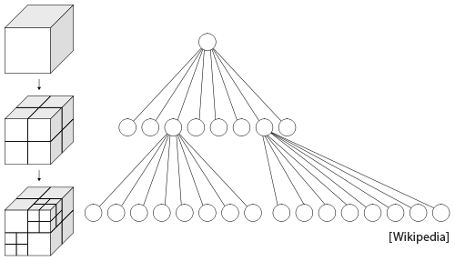

# Ray-Tracing-Acceleration-Data-Structures-Point-Lights
Nori based implementation of an octree, a hierarchical data structure that enables fast ray intersection computations involving very large numbers of triangles. In addition, we are implementing a simple shading model using a single point light.

Note: To run the code please see https://github.com/hsouri/nori-base-2019. Replace include and src files with the folders given in this repo and run!


Part 1: Octree construction




Each node of an octree covers an axis-aligned region of space denoted by two points p_min
 and p_max
. An interior node has exactly eight child nodes that partition this space into eight equal-sized subregions. The region of space covered by the 
i
-th child of an octree-node is defined as the bounding box containing both the center and the 
i
-th corner of its parent (using a suitable ordering of the corners). In the context of rendering, our goal will be to construct a tree where each leaf node only contains a small number of triangles (e.g. less than 10). At render time, this will allow most ray intersections to be pruned away since any ray will only touch a small number of octree nodes. An efficient ray intersection algorithm will then only traverse this subset of nodes until the closest intersection is found.

The implementation can be found in include/nori/accel.h and include/nori/accel.cpp. Our main concern is the function:

```shell
bool rayIntersect(const Ray3f &ray, Intersection &its, bool shadowRay) const;
```

Part 2: Point lights

The base code includes a scene scenes/pa2/ajax-simple.xml that instantiates a (currently nonexistent) integrator/rendering algorithm named simple, which simulates a single point light source located at a 3D position position, and which emits an amount of energy given by the parameter energy.

We create a new Integrator that accepts these parameters. The output of this integrator should be like the following:


Note: This is the official project description https://www.cs.umd.edu/class/spring2020/cmsc740/nori/
